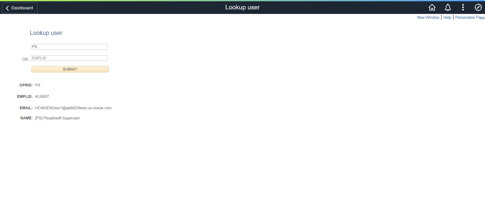

# PeopleSoft User Lookup
PeopleSoft utility to look up a user.



## How to Install
### Step 1: Import the custom menu and folder
1. Launch Application Designer 
2. click Tools, Copy Project, From File...   
3. click Select, choose MXM_CUSTOM_INIT
4. click Copy

### Step 2: Import the project
1. Launch Application Designer
2. Click Tools, Copy Project, From File...   
3. Click Select, choose MXM_USRLKUP
4. Click Copy

### Step 3. Register the component
1. Open the component
2. Click Tools, Register Component...
3. Check off the following:
   - Add this component to a menu
   - Add this component to a portal registry
   - Add this component to a permission list
4. Click Next
5. Select Menu Name: MXM_CUSTOM_MENU and Bar Name: USE
6. Click Next
7. Select Folder Name: MXM_CUSTOM
8. Change Content Reference Label and Long Description fields to the title of the page
9. Check off Always use default local node
10. Click Next
11. Select Permission List Name: PTPT1200
12. Click Next
13. Check off Registry entry under Add to project
14. Click Finish

## Technical Documentation
### App Designer Project: MXM_USRLKUP
### Records

Record: MXM_USRLKUP_WRK
| Field | Type | Length | Long Descr | Short Descr |
| ------ | --------- | --------- | --------- | --------- |
| OPRID | Char | 30 | User ID |  User |           
| EMPLID | Char | 11 | Empl ID | ID |             
| SUBMIT_BTN | Char | 1 | Submit Button |  Submit |         
| DESCRLONG | Long | 0 | Description | Descr |  


Record: MXM_USRLKUP_TMP
| Field | Type | Length | Long Descr | Short Descr |
| ------| --------- | --------- | --------- | --------- |
| OPRID | Char | 30 | User ID | User |           
| EMPLID | Char | 11   Empl ID | ID |             
| EMAILID | Char | 70   Email ID | Email ID |       
| OPRDEFNDESC | Char | 30 | Description | Description |    


### SQL
SQL: MXM_USRLKUP_OPRID
```sql
SELECT OPRID,
EMPLID,
EMAILID,
OPRDEFNDESC
FROM PSOPRDEFN
WHERE OPRID = :1
```

SQL: MXM_USRLKUP_EMPLID
```sql
SELECT OPRID,
EMPLID,
EMAILID,
OPRDEFNDESC
FROM PSOPRDEFN
WHERE EMPLID = :1
```

### Page
Page: MXM_USRLKUP   
Title: Lookup user     
MXM_USRLKUP_WRK.OPRID
MXM_USRLKUP_WRK.EMPLID
MXM_USRLKUP_WRK.SUBMIT_BTN
MXM_USRLKUP_WRK.DESCRLONG

MXM_USRLKUP_TMP.OPRID
MXM_USRLKUP_TMP.EMPLID
MXM_USRLKUP_TMP.EMAILID
MXM_USRLKUP_TMP.OPRDEFNDESC


### PeopleCode
Event: Page Activate
```
MXM_USRLKUP_WRK.OPRID.HtmlAttributes = "placeholder=""OPRID""";
MXM_USRLKUP_WRK.EMPLID.HtmlAttributes = "placeholder=""EMPLID""";

MXM_USRLKUP_TMP.OPRID.Visible = False;
MXM_USRLKUP_TMP.EMPLID.Visible = False;
MXM_USRLKUP_TMP.EMAILID.Visible = False;
MXM_USRLKUP_TMP.OPRDEFNDESC.Visible = False;
```

Event: MXM_USRLKUP_WRK.SUBMIT_BTN FieldChange
```
Local string &inputOPRID, &inputEMPLID;
Local string &OPRID, &EMPLID, &EMAILID, &OPRDEFNDESC;

If All(MXM_USRLKUP_WRK.OPRID.Value) Then
   SQLExec(SQL.MXM_USRLKUP_OPRID, &inputOPRID, &OPRID, &EMPLID, &EMAILID, &OPRDEFNDESC);
   MXM_USRLKUP_TMP.OPRID.Value = &OPRID;
   MXM_USRLKUP_TMP.EMPLID.Value = &EMPLID;
   MXM_USRLKUP_TMP.EMAILID.Value = &EMAILID;
   MXM_USRLKUP_TMP.OPRDEFNDESC.Value = &OPRDEFNDESC;
Else
   If All(MXM_USRLKUP_WRK.OPRID.Value) Then
      SQLExec(SQL.MXM_USRLKUP_EMPLID, &inputEMPLID, &OPRID, &EMPLID, &EMAILID, &OPRDEFNDESC);
      MXM_USRLKUP_TMP.OPRID.Value = &OPRID;
      MXM_USRLKUP_TMP.EMPLID.Value = &EMPLID;
      MXM_USRLKUP_TMP.EMAILID.Value = &EMAILID;
      MXM_USRLKUP_TMP.OPRDEFNDESC.Value = &OPRDEFNDESC;
   End-If;
End-If;

If All(&OPRID) Then
   MXM_USRLKUP_TMP.OPRID.Visible = True;
   MXM_USRLKUP_TMP.EMPLID.Visible = True;
   MXM_USRLKUP_TMP.EMAILID.Visible = True;
   MXM_USRLKUP_TMP.OPRDEFNDESC.Visible = True;
Else
   MXM_USRLKUP_TMP.OPRID.Visible = False;
   MXM_USRLKUP_TMP.EMPLID.Visible = False;
   MXM_USRLKUP_TMP.EMAILID.Visible = False;
   MXM_USRLKUP_TMP.OPRDEFNDESC.Visible = False;
End-If;
```

### Component

| Component | MXM_USRLKUP | 
| ------| --------- |
| Page | MXM_USRLKUP | 
| Navigation | Custom Components > Lookup user | 
| Item Label | Lookup user | 
| Search Record | INSTALLATION |
| Add | Selected | 
| Update Display | Selected |
| Disable Saving Page | Selected | 
| Menu | MXM_CUSTOM_MENU |
| Bar item Name | MENUITEM | 
| Portal | Employee |
| Folder Name | MXM_CUSTOM | 
| Content Reference label | Lookup user |
| Long Description | Lookup user | 
| Sequence Number | 0 |
| Always Use Local Node | Selected | 
| Permission Lists | PTPT1200 |
| Actions | Add, Update/Display |


## Feedback:
Please create a GitHub Issue for any bugs, feature requests, etc. Happy to accept pull requests too!

